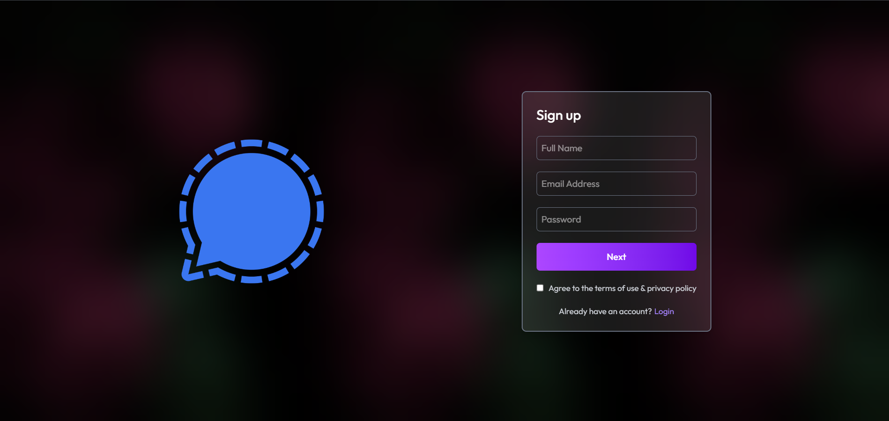
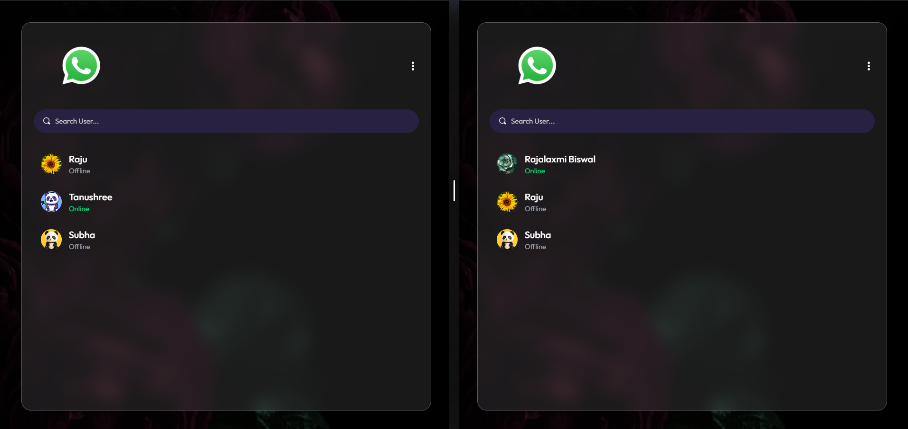

<div align="center">

# 💬 ChatSphere — Real-Time Chat Application

### A Full-Stack Chat App with Real-Time Messaging, Authentication & Media Sharing

[](https://react.dev/)
[](https://nodejs.org/)
[](https://expressjs.com/)
[](https://www.mysql.com/)
[](https://sequelize.org/)
[](https://vitejs.dev/)
[](https://cloudinary.com/)

</div>

---

## 📖 About The Project

ChatSphere is a full-stack real-time chat application built with React, Node.js, Express, and MySQL that enables secure authentication, instant messaging, and image sharing.

---

## ✨ Features

- 🔐 **Secure Authentication** — JWT-based login & signup with protected routes
- 💬 **Real-Time Messaging** — Instant one-to-one conversations
- 🖼️ **Media Sharing** — Upload and share images via Cloudinary
- 🧑‍🤝‍🧑 **Contact Sidebar** — View and search all your conversations
- 🌓 **Responsive UI** — Works seamlessly across desktop and mobile
- ⚡ **Fast & Lightweight** — Powered by Vite for blazing-fast builds
- 🗂️ **Global State Management** — Context API for auth and chat state
- 🛡️ **Middleware-Protected Routes** — Auth middleware guarding server endpoints

---

## 🛠️ Tech Stack

**Frontend**
- React (Vite)
- Context API (`AuthContext`, `ChatContext`)
- Tailwind CSS
- Axios

**Backend**
- Node.js & Express.js
- MySQL with Sequelize ORM (`User`, `Message` models)
- JSON Web Token (JWT) for authentication
- Cloudinary for image storage
- Custom Auth Middleware

---

## 📁 Project Structure

```
FULLSTACK-CHAT-APP/
├── client/                     # React frontend
│   ├── context/
│   │   ├── AuthContext.jsx
│   │   └── ChatContext.jsx
│   ├── public/
│   ├── src/
│   │   ├── assets/
│   │   ├── components/
│   │   │   ├── ChatContainer.jsx
│   │   │   ├── RightSidebar.jsx
│   │   │   └── Sidebar.jsx
│   │   ├── lib/
│   │   │   └── utils.js
│   │   ├── pages/
│   │   ├── App.jsx
│   │   ├── index.css
│   │   └── main.jsx
│   ├── .env
│   └── package.json
│
├── server/                     # Node/Express backend
│   ├── controllers/
│   │   ├── messageController.js
│   │   └── userController.js
│   ├── lib/
│   │   ├── cloudinary.js
│   │   ├── db.js
│   │   └── utils.js
│   ├── middleware/
│   │   └── auth.js
│   ├── models/
│   │   ├── Message.js
│   │   └── User.js
│   ├── routes/
│   │   ├── messageRoutes.js
│   │   └── userRoutes.js
│   ├── .env
│   ├── server.js
│   └── package.json
│
└── README.md
```

---

## 🚀 Getting Started

Follow these steps to set up the project locally.

### Prerequisites

- [Node.js](https://nodejs.org/) (v18 or higher)
- [MySQL](https://www.mysql.com/) with [Sequelize ORM](https://sequelize.org/) (local instance or a hosted service like [PlanetScale](https://planetscale.com/)/[Railway](https://railway.app/)/[AWS RDS](https://aws.amazon.com/rds/))
- A [Cloudinary](https://cloudinary.com/) account (for image uploads)

### Installation

1. **Clone the repository**
   ```bash
   git clone https://github.com/<your-username>/<your-repo-name>.git
   cd <your-repo-name>
   ```

2. **Set up the backend**
   ```bash
   cd server
   npm install
   ```

   Create a `.env` file in `server/` with the following variables:
   ```env
   PORT=5000
   DB_HOST=your_mysql_host
   DB_PORT=3306
   DB_NAME=your_database_name
   DB_USER=your_mysql_username
   DB_PASSWORD=your_mysql_password
   JWT_SECRET=your_jwt_secret_key
   CLOUDINARY_CLOUD_NAME=your_cloud_name
   CLOUDINARY_API_KEY=your_api_key
   CLOUDINARY_API_SECRET=your_api_secret
   ```

   Start the server:
   ```bash
   npm run server
   ```

3. **Set up the frontend**
   ```bash
   cd ../client
   npm install
   ```

   Create a `.env` file in `client/` with:
   ```env
   VITE_BACKEND_URL=http://localhost:5000
   ```

   Start the client:
   ```bash
   npm run dev
   ```

4. **Open the app**

   Navigate to `http://localhost:5173` in your browser.

---

## 📸 Screenshots

| Login Page | Chat Interface |
|:---:|:---:|
|  |  |

---

## 🗺️ Roadmap

- [ ] Add group chat functionality
- [ ] Push notifications for new messages
- [ ] Message read/delivered receipts
- [ ] Voice & video calling
- [ ] Dark mode toggle


---

## 🤝 Contributing

Contributions make the open-source community a great place to learn and grow. Any contributions are **greatly appreciated**.

1. Fork the project
2. Create your feature branch (`git checkout -b feature/AmazingFeature`)
3. Commit your changes (`git commit -m 'Add some AmazingFeature'`)
4. Push to the branch (`git push origin feature/AmazingFeature`)
5. Open a Pull Request

---

## 📄 License

Distributed under the MIT License. See `LICENSE` for more information.

---

## 👤 Author

**Rajalaxmi Biswal**

- GitHub: [Rajalaxmi Biswal](https://github.com/rajalaxmibiswal)
- Email: rajalaxmibiswal2005@gmail.com

---

## 🙏 Acknowledgements

- [React Documentation](https://react.dev/)
- [Sequelize Documentation](https://sequelize.org/docs/v6/)
- [MySQL Documentation](https://dev.mysql.com/doc/)
- [Cloudinary Documentation](https://cloudinary.com/documentation)

<div align="center">

⭐️ If you found this project helpful, consider giving it a star on GitHub!

</div>
